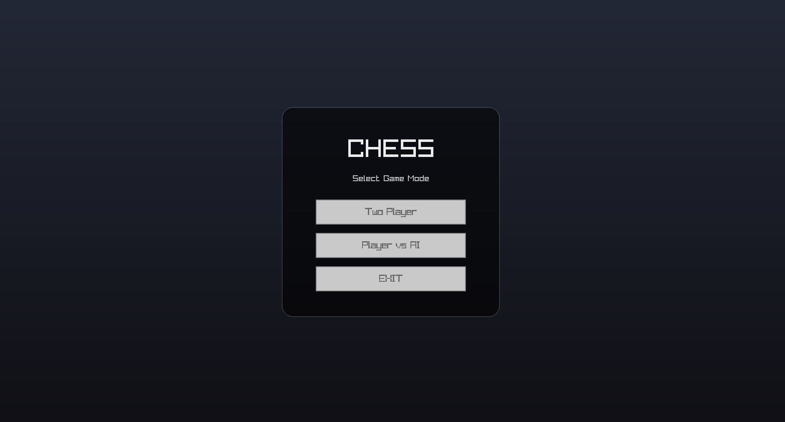

# 3D Chess Engine

A blazingly fast, bitboard-based C++ chess engine paired with a real-time 3D OpenGL renderer, multithreaded AI opponent, and full audio support.
---

## Description
A robust C++ Chess Engine featuring a dedicated **3D Renderer** powered by **raylib**. Built on highly optimized bitboard architectures (utilizing both standard and magic bitboards), this engine offers a massive performance leap over traditional array-based structures. 
The front-end renders clean, 3D chess pieces and dynamic lighting, while the back-end runs a highly optimized AI on a separate thread. Combined with integrated background music and sound effects, it bridges low-level engine speed with a smooth, modern 60 FPS gameplay experience.

---

## Key Features
* **Advanced AI Opponent:** 
  * Features a custom engine utilizing **Negamax with Alpha-Beta Pruning**.
  * **Quiescence Search** to prevent horizon effect blunders.
  * **MVV-LVA** (Most Valuable Victim - Least Valuable Attacker) move ordering for highly efficient branch pruning.
  * **Mop-Up Heuristic** allows the AI to force checkmates in endgames.
* **Multithreaded Architecture:** AI calculations run asynchronously via `std::thread`, ensuring the UI and animations never freeze during deep searches.
* **Bitboard Architecture:** Uses normal and magic bitboards for ultra-fast move generation and static evaluation.
* **Raylib 3D Graphics & Audio:** Full 3D board, piece models, custom shaders, dynamic lighting calculations, background music, and piece-movement sound effects.
* **Game Modes:** Features a fully interactive Main Menu with options for local **Two Player** or **Player vs AI** (with adjustable depth/difficulty settings).
* **Comprehensive Rule Enforcement:** Full implementation of standard chess rules including En Passant, Castling, Pawn Promotion, checkmate, and stalemate detection.
---

## Media

  
  
  

---

## Controls & Gameplay

Navigate the menus using your mouse. During gameplay, the engine reads keyboard inputs to navigate the 3D board selector and handle selections.
### Board Navigation
* **W** -> Move selector **Up** 
* **A** -> Move selector **Left**
* **S** -> Move selector **Down** 
* **D** -> Move selector **Right**
* **Enter** -> Select/Place Piece
### Pawn Promotion
When a pawn reaches the final rank, input one of the following numbers to choose your promotion piece:
* **1** -> Knight
* **2** -> Bishop
* **3** -> Rook
* **4** -> Queen

---

## Compilation and Build Instructions

This project uses **CMake** for clean, cross-platform out-of-source builds.

### Running the Pre-compiled Executable

If you do not want to compile the source code yourself, a pre-compiled executable is available with the project so you don't have to.

---
### Prerequisites
Ensure you have `g++`, `cmake`, `make`, and the `raylib` library installed on your machine. 

On Linux (Debian/Ubuntu), you can install the build essentials, CMake, and the necessary audio dependencies via:
```bash
sudo apt update
sudo apt install build-essential cmake libasound2-dev
```
## Building the Project

To compile the source code and generate the standalone static executable (chess_engine), run the following command in the root directory:

```bash
mkdir build
cd build
cmake ..
make
```
## Cleaning Build Files

To remove the compiled binary and prepare for a clean rebuild, run:

```bash
rm -rf build
```

---
### Credits & Resources    
* [Magic Board Implementation By Code Monkey King](https://github.com/maksimKorzh/chess_programming/blob/master/src/magics/magics.c)  
* [ASCII Art Core: Built using tools from ASCII-ART by 7IRE.](https://github.com/7IRE/ASCII-ART)
* [Legacy Version: Check out the original, array-based predecessor: (Chess V-1) Based on Arrays.](https://github.com/7IRE/CHESS-ENGINE) 
* [Raylib - Simple and easy-to-use library to enjoy videogames programming.](https://www.raylib.com/)

* Music by <a href="https://pixabay.com/users/samuelfjohanns-1207793/?utm_source=link-attribution&utm_medium=referral&utm_campaign=music&utm_content=156750">Samuel F. Johanns</a> from <a href="https://pixabay.com//?utm_source=link-attribution&utm_medium=referral&utm_campaign=music&utm_content=156750">Pixabay</a>
* Sound Effect by <a href="https://pixabay.com/users/freesound_community-46691455/?utm_source=link-attribution&utm_medium=referral&utm_campaign=music&utm_content=103913">freesound_community</a> from <a href="https://pixabay.com//?utm_source=link-attribution&utm_medium=referral&utm_campaign=music&utm_content=103913">Pixabay</a>
* Sound Effect by <a href="https://pixabay.com/users/soundshelfstudio-46480698/?utm_source=link-attribution&utm_medium=referral&utm_campaign=music&utm_content=518051">SoundShelfStudio</a> from <a href="https://pixabay.com/sound-effects//?utm_source=link-attribution&utm_medium=referral&utm_campaign=music&utm_content=518051">Pixabay</a>
* Sound Effect by <a href="https://pixabay.com/users/creatorshome-49707711/?utm_source=link-attribution&utm_medium=referral&utm_campaign=music&utm_content=337219">CreatorsHome</a> from <a href="https://pixabay.com//?utm_source=link-attribution&utm_medium=referral&utm_campaign=music&utm_content=337219">Pixabay</a>