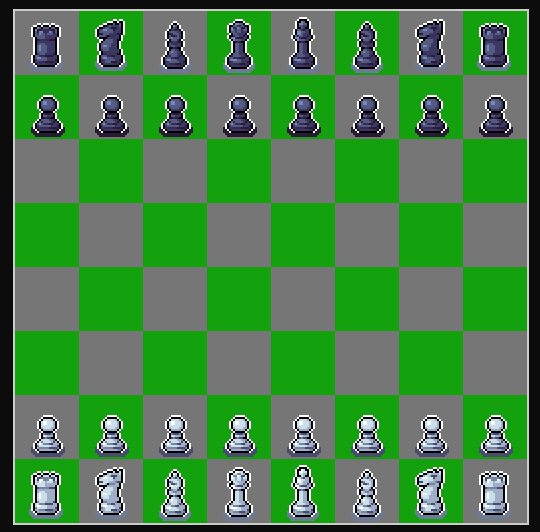
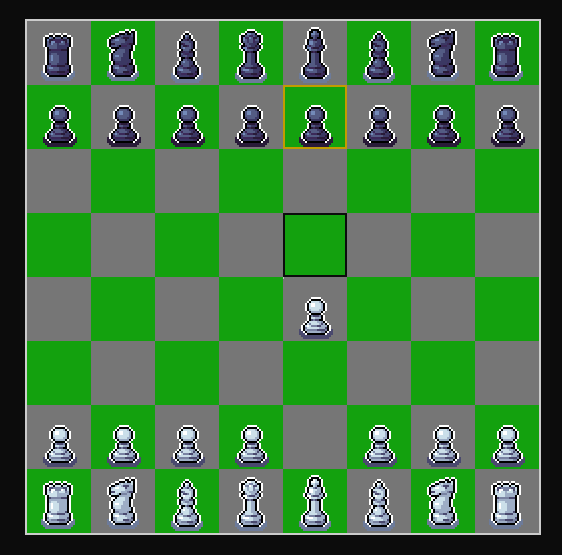
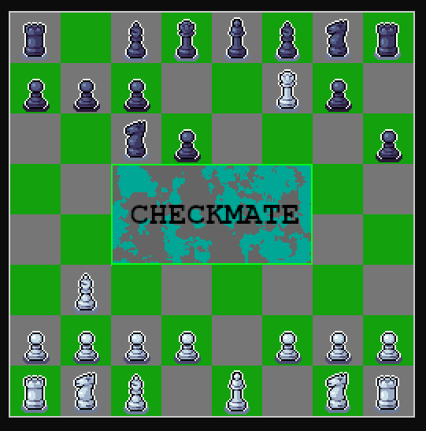

# Terminal Chess Engine

A blazingly fast, bitboard-based C++ chess engine featuring an optimized, selective-rendering terminal GUI.

---

## Description

Have you ever wanted to play chess right in your terminal, but wanted it to actually look good? 

This project delivers exactly that: a robust C++ Chess Engine paired with a dedicated Terminal Renderer capable of displaying full-fledged pieces. Built on highly optimized bitboards (both standard and magic bitboards), this implementation offers a massive performance leap over traditional array-based architectures. 

It is designed to serve as a rock-solid foundation for further development, such as building a chess AI or a more complex chess application.

### Key Features
* **Bitboard Architecture:** Uses normal and magic bitboards for ultra-fast move generation and evaluation.
* **Optimized Terminal Renderer:** Utilizes custom ASCII art and updates only the specific parts of the board that change, minimizing screen flicker.
* **Comprehensive Rule Enforcement:** Full implementation of standard chess rules:
  * Move validation and check/checkmate/stalemate detection.
  * Special moves: En Passant and Castling (both kingside and queenside).
  * Pawn promotion, the 50-move rule, and draw detection.

---

## Media





---

## Controls & Gameplay

The engine reads raw character inputs to navigate the board and handle selections.

### Board Navigation
* **W** -> Move selector **Up**
* **A** -> Move selector **Left**
* **S** -> Move selector **Down**
* **D** -> Move selector **Right**

### Pawn Promotion
When a pawn reaches the final rank, input one of the following numbers to choose your promotion piece:
* **1** -> Knight
* **2** -> Bishop
* **3** -> Rook
* **4** -> Queen

> ⚠️ **Important Note on Terminal Size:** Due to how terminal drawing functions, you must manually scale your terminal window so the entire board fits without wrapping. An alignment text block will appear at startup. Use `Ctrl` + `+` or `Ctrl` + `-` to resize your terminal until the text is perfectly aligned. Once aligned, press any key followed by `Enter` to start the game.

---

## Compilation and Build Instructions

The project includes a pre-configured `Makefile` for easy compilation using `g++`.

### Prerequisites
Ensure you have `g++` and `make` installed. On Linux (Debian/Ubuntu), you can install them via:
```bash
sudo apt update
sudo apt install build-essential

```
### Building the Project

To compile the source code and generate the standalone static executable (chess_engine), run the following command in the root directory:

```bash
make
```
### Cleaning Build Files

To remove the compiled binary and prepare for a clean rebuild, run:

```bash
make clean
```

---
### Integration & Customization Guide

If you intend to fork this project or integrate its components into your own application, keep the following structure in mind:

> Renderer Class: Handles the custom ASCII rendering. It uses selective updates designed specifically for terminal efficiency.

> Input Class: Responsible for reading raw keyboard characters and translating them into engine actions.

> Board Class: Controls game state. Inside the Move Piece function, when a pawn triggers a promotion event, the board requests the target piece by calling the getRawChar method from the Input class.

### Optional Modifications

>Customizing Selection Behavior: If you want to change how pieces are selected (e.g., typing coordinates instead of using a cursor), modify the SelectionFunction inside the Board class. You can alter it to read target ranks and files directly from a different input buffer.

---

### Credits & Resources

    
* [Magic Board Implementation By Code Monkey King](https://github.com/maksimKorzh/chess_programming/blob/master/src/magics/magics.c)  
* [ASCII Art Core: Built using tools from ASCII-ART by 7IRE.](https://github.com/7IRE/ASCII-ART)
* [Legacy Version: Check out the original, array-based predecessor: (Chess V-1) Based on Arrays.](https://github.com/7IRE/CHESS-ENGINE) 

---